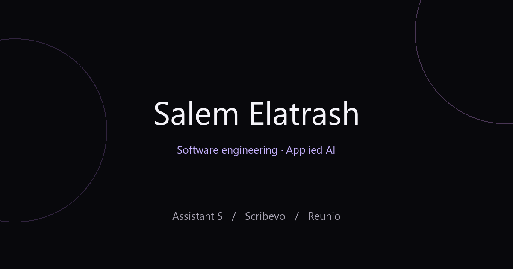

# Salem Elatrash · Portfolio

Software engineering, applied AI and data projects, presented through clear public case studies.

**[Visit the portfolio](https://slooma951.github.io/portfolio/)**

| Project | What it explores | Read more |
| --- | --- | --- |
| **Scribevo** (original research name: WordFlow) | Writing support for dyslexic students, NLP and a reviewable correction interface | [Case study](https://slooma951.github.io/portfolio/case-studies/scribevo.html) · [Public overview](https://github.com/Slooma951/Scribevo) |
| **Assistant S** | An Electron desktop workspace with an animated companion | [Case study](https://slooma951.github.io/portfolio/case-studies/assistant-s.html) |
| **Reunio** | Lost-property logging, matching and checked returns for front desks | [Case study](https://slooma951.github.io/portfolio/case-studies/reunio.html) |

## Design

A centred typed name, fixed black/white/lavender cosmic palette, iOS-style buttons, animated SVG skill icons and a swipeable project carousel. The three selected projects are Assistant S, Scribevo and Reunio, shown with product pictures and View more links opening dedicated pages in new tabs. Keyboard controls, hidden-slide focus protection and reduced-motion preferences are supported. The downloadable public CV omits phone and student email. Project illustrations make no network requests.

## Public and private material

This repository contains the static portfolio and public project descriptions. It does not contain the private implementation of Scribevo or Assistant S. Those descriptions communicate the problem, approach, contribution and evaluation limits. They do not include credentials, private conversations, datasets or trained artefacts.

The repository is named **portfolio**. A separate minimal compatibility repository at `projectweb` preserves the old support and privacy links used by the published Scribevo listing.

## Review locally

Serve this folder with any static web server. No dependency installation or build step is required for the site. `build_content.py` regenerates the original written case studies and conceptual diagrams. The Reunio page is maintained directly in `case-studies/reunio.html`.

Project status and measured results are dated. See each case study for limitations rather than treating historical results as current product guarantees.
